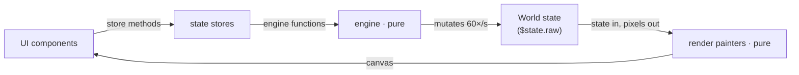
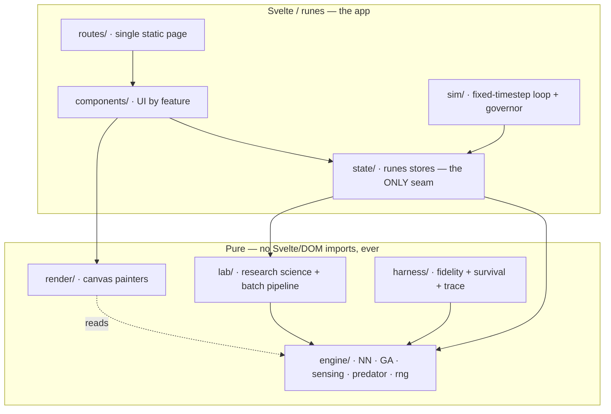
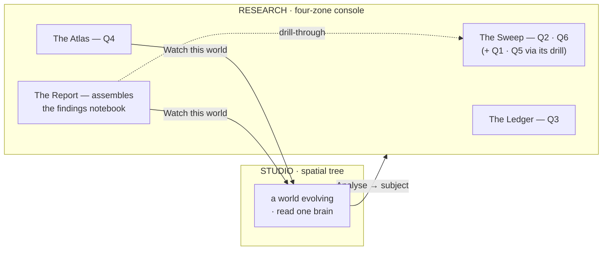
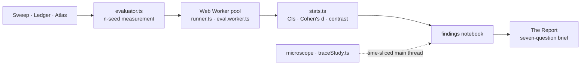

# Architecture — Darwin Lab

Darwin Lab is a client-only SvelteKit app (static SPA via `adapter-static`, no backend) for
**neuroevolution**: tiny neural-net fish evolve real behavior against a fixed-rule shark. The vendored
original implementation and its measurement notes live in [reference/](reference/) — the port is held
bit-exact to it (see [Honesty gates](#honesty-gates)).

## Organizing principle

**The science is walled off from the UI.** The engine is pure, framework-agnostic TypeScript with zero
Svelte/DOM imports, so it runs identically in the app, in unit tests, and in the headless survival
bench. The UI wraps the engine; it never leaks into it. The UI mutates simulation state **only** through
the state stores, which call engine functions.

## The module map

The dependency arrows only ever point **inward**, toward the pure core. Nothing in `engine/`, `render/`,
`lab/`, or `harness/` imports Svelte or the DOM — which is exactly what lets the same code run the app,
the unit tests, and the headless bench, and what keeps the bit-exact fidelity gate honest.

### Pure core — science & rendering

| Directory  | Responsibility                                                                                                                                                                                                                                                                                                                                                                                                                                                                                                                    |
| ---------- | --------------------------------------------------------------------------------------------------------------------------------------------------------------------------------------------------------------------------------------------------------------------------------------------------------------------------------------------------------------------------------------------------------------------------------------------------------------------------------------------------------------------------------- |
| `engine/`  | The neuroevolution science: network (8→6→2 tanh, wider when a world carries extra senses), genetics (GA), sensing, world step, predator AI, flocking order params (`flock.ts`), seeded RNG, story beats. Constants are **empirically tuned** — re-measure (`npm run bench:survival` / `bench:schooling`) before changing any. Every extra sense (proprioception, the shoal senses) and predator knob (persistence, the confusion effect) is **optional** and defaults to reference behaviour, which is what keeps fidelity green. |
| `render/`  | Pure canvas painters — `drawWorld`, `drawBrain`, `drawCurve`, hit-testing (`pick`), theme palettes (kept in sync with the CSS tokens). State in, pixels out.                                                                                                                                                                                                                                                                                                                                                                      |
| `lab/`     | The Research **science** + the batch pipeline (see [the batch spine](#the-batch-spine)): `evaluator` (n-seed measurement), the worker pool (`runner` · `eval.worker` · `protocol`), `stats` (bootstrap CIs, Cohen's d, seeded two-arm contrast), the instruments' pure cores (`sweep` · `hypothesis` · `landscape`), `questions` (the seven-question model), `evidence`, `run` (configHash + citable manifest), `lineage` (canvas geometry).                                                                                      |
| `harness/` | The honesty gates: the bit-exact fidelity spec against `reference/engine2.js`, and the headless survival sweep the science claims are measured with. Also the behaviour recorders — `trace.ts` (one bout's paths) + `traceStudy.ts` (evolve → learning curve + evolved-vs-control study), read-only so fidelity stays green.                                                                                                                                                                                                      |

### Reactive app — state, loop & UI

| Directory     | Responsibility                                                                                                                                                                                                                                                                   |
| ------------- | -------------------------------------------------------------------------------------------------------------------------------------------------------------------------------------------------------------------------------------------------------------------------------- |
| `state/`      | Svelte 5 runes stores — **the only seam between UI and simulation** (key stores below).                                                                                                                                                                                          |
| `sim/`        | `loop.ts` — the visibility-safe fixed-timestep loop (`setTimeout`, never bare rAF: rAF throttles offscreen and would freeze the sim). `governor.ts` — one-way downgrade of cinematic detail under sustained frame-time pressure (stands down during turbo training by design).   |
| `components/` | UI by feature: `intro` (full-screen welcome that fades over the already-running platform), `topbar`, `bench` (`LineageCanvas` — the pannable plane of draggable `WorldTile` nodes wired parent→child by branch edges), `conditions`, `inspector`, `story`, `research`, `common`. |
| `routes/`     | Single bench page; `ssr=false`, `prerender=true` (client-only static SPA). Vite bundles `eval.worker.ts` as its own module chunk.                                                                                                                                                |
| `styles/`     | Design tokens (both themes as CSS custom properties) + global styles.                                                                                                                                                                                                            |

### Key state stores

| Store                                                  | Owns                                                                                                                                                                                                   |
| ------------------------------------------------------ | ------------------------------------------------------------------------------------------------------------------------------------------------------------------------------------------------------ |
| `app.svelte.ts`                                        | The **mode** (Studio \| Research, persisted), the active Research **instrument**, and the analysis **subject** (a Studio world handed to Research).                                                    |
| `bench.svelte.ts`                                      | Which worlds exist, selection, conditions, `tick()`; `branchWorld`/`moveWorld` drive the lineage tree; `analyzeWorld` hands a world to Research.                                                       |
| `views.svelte.ts`                                      | Reactive projections components bind to — `WorldStats` / `WorldConfigView` / `MindView` / `LineageView`.                                                                                               |
| `viewport.svelte.ts`                                   | The generic pan/zoom **camera**; the lineage canvas and the Atlas each own one instance, never shared.                                                                                                 |
| `research.svelte.ts`                                   | The one running batch (progress, cancel-on-new).                                                                                                                                                       |
| `sweep` · `ledger` · `landscape` · `trace`             | The instruments' state: factors→effects · claims→verdicts · axes→landscape · the microscope (evolve→learning-curve + mechanism, keyed by recipe; its **own** time-sliced study, not the worker batch). |
| `findings.svelte.ts`                                   | The persisted findings **notebook** (any instrument writes to it).                                                                                                                                     |
| `report.svelte.ts`                                     | The seven-question brief derived from the notebook (the honesty rail lives here).                                                                                                                      |
| `playback` · `story` · `theme` · `motion` · `painters` | Play/pause/speed/turbo · scenes + scene clock + new-sense tagging · theme (**dark** by default, monochrome) · reduced-motion · the paint-on-change registry.                                           |

**The load-bearing rule:** a `World` is mutated 60×/s and holds every genome, so it lives in
`$state.raw` and is never reactive. Components never read `world.*` directly — they bind to the
projections in `state/views.svelte.ts` and mutate only through store methods. If a component is writing
`entry.world.x = ...`, the fix is a new store method.

## The lineage canvas

The bench is a spatial **tree**, not a grid. Each world is a node with a reactive `LineageView` (its
`x`/`y` on the plane and its `parentId`/`childIds`), placed and moved only by the store (`branchWorld`,
`moveWorld`, the initial auto-layout).

**Branch** forks a world into a wired child that inherits the parent's evolved genomes at the current
generation, drops below it, and opens Conditions to change one thing — a controlled experiment with a
common ancestor, so any later difference is caused by the one variable, not a fresh random start. The
camera (one `translate…scale` transform) lives in `canvas.svelte.ts`, separate from the bench because
moving the camera touches no genome.

## Studio + Research

The lab is one place with two modes (`app.svelte.ts`, flipped from the top bar). **Studio** is the
spatial tree above — watch a world evolve, read one brain. **Research** is a four-zone console over the
**seven questions a rigorous study must answer** (`lab/questions.ts`; each instrument declares which it
settles via the `ANSWERS` map, shown as `QuestionTags`).

### The four instruments

- **The Sweep** _(Q2 · Q6, and Q1 · Q5 via its drill)_ — a factorial → each factor's effect on survival
  with intervals, the pairwise interactions, and a convergence check. Its **drill sidebar** opens any
  run; the **microscope** there is the behaviour trace (below).
- **The Ledger** _(Q3)_ — a claim → one pre-registered contrast → a supported/refuted verdict, kept.
- **The Atlas** _(Q4)_ — two parameters → a pannable survival landscape with the measured cliff.
- **The Report** — assembles the **findings notebook** (`state/findings.svelte.ts`, a persisted envelope
  any instrument writes to) into a seven-question brief (`state/report.svelte.ts`): a coverage spine, an
  **auto-composed abstract** (`report/compose.ts`, templated from real findings — never authored),
  numbered figures each drawn from the evidence that settled it, a **tensions** check, and a
  reproduce-this method; exportable to Markdown/PDF.

**The microscope** _(Q1 · Q5)_ is the second discovery type, folded into the Sweep drill rather than
given its own tab: drill a run, **Trace this world**, and it evolves ONE population _keeping_ its genomes
(`harness/traceStudy.ts`, keyed by recipe in `state/trace.svelte.ts`), reads `World.lifeCurve` for the
learning curve, then traces that school against a random-brain control (the mechanism is the contrast).
It is a deliberate, time-sliced main-thread study — the exception to the batch spine below.

### The batch spine

The measuring instruments are thin UIs over one spine: the pure `evaluator` on a **Web Worker pool**
aggregated by honest `stats.ts`. **The engine and the fidelity gate are never touched** — Research, the
curve capture included, only ever _reads_ the engine.

A round-trip stitches the modes: **Analyse** hands a Studio world to Research as the subject every
instrument explores (`app.analyze`), **Watch this world** drops an Atlas point or the Report's subject
back onto the bench (`landscape.watch` / `report.watch`), and a Report **drill-through** navigates from a
conclusion back to the instrument that produced it (`app.setInstrument`).

### Honesty rails (load-bearing)

| Instrument     | The rail it holds                                                                                                                                                                                                |
| -------------- | ---------------------------------------------------------------------------------------------------------------------------------------------------------------------------------------------------------------- |
| **The Sweep**  | An exploratory sweep shows effect **intervals only** — no significance badge, because it is many comparisons.                                                                                                    |
| **The Ledger** | A verdict word ("supported"/"refuted") is emitted **only** here, and only from a single contrast fixed **before** the run.                                                                                       |
| **The Atlas**  | The cliff is the steepest measured fall-off; it draws **nothing** on a flat or rising field rather than inventing a threshold.                                                                                   |
| **The Report** | Answers a question **only** when a real finding backs it — every other question stays an honest "run the test" prompt. It renders the same snapshot the screen does, so it can never say more than was measured. |

## Honesty gates

1. **Port fidelity** (`src/lib/harness/fidelity.spec.ts`) — seeds the RNG and drives our engine and the
   vendored `reference/engine2.js` off the same draw stream, asserting **bit-identical** state. If it
   fails, the port diverged — it is never loosened.
2. **The science** (`src/lib/harness/survival.spec.ts` + `npm run bench:survival`) — seeded sweeps pin
   the honest finding (Direction is the only sense that clearly pays, extras don't stack). A nightly CI
   job re-measures and fails if any world drifts >5pp off its measured baseline.
3. **Schooling** (`npm run bench:schooling`) — a 2×2 ablation that measures whether flocking evolves,
   scored by the shoal sense's **marginal** effect (sense-on vs sense-off at equal ocean) and by
   training-life, so evolved grouping is separated from the artifact of a confusion effect simply keeping
   more fish alive. It confirms schooling both evolves **and** pays under predator attention (a shark
   that loses its lock in a dense swarm), and does not under the mechanics that came before it. Any
   world's **Sense the shoal** condition runs this experiment live.

## Non-negotiable constraints

- **Each fish owns its own 68-weight genome** — never collapse to one shared brain.
- **A disabled sense feeds 0** into its input slot — that's what makes toggling a sense a true ablation.
- **Deployed mode never respawns** — the population decays to zero (training-time generation resets are
  a separate, correct mechanism).
- **No pointer may outlive its creature** — selection/hover/sense pointers are cleared when a fish is
  eaten, when its generation is replaced, and on world reset.
- **The honest finding stays** — more senses ≠ more intelligence. Don't fake a clean ladder.

## Developer tooling

A thin **`Makefile`** over `scripts/make/` is the one entry point — `make run` does setup + start end to
end (Node check, dependency install, port allocation, readiness poll). The Makefile only dispatches; each
script (`install.sh`, `run.sh`, `run-tests.sh`, `run-linters.sh`, `deploy.sh`) owns its logic and shares
one bash-3.2-safe UI library. Tests and linters aggregate — every gate runs, the exit code ORs them — so
no failure is hidden behind an earlier one.

## Deployment

Static build, deployed to GitHub Pages. The Pages sub-path is env-guarded: `BASE_PATH=/darwinlab npm run
build` produces the Pages-shaped build; local dev and plain builds stay at `/`, using relative asset
paths so the same bundle works at either root.

Publishing is **decoupled from merging, on purpose**. Every push to `main` runs `verify` + the full e2e
suite (the health signal) but **deploys nothing**; the deploy job is gated on a manual
`workflow_dispatch`, triggered by **`make deploy`** — which shows the gap between the live SHA and current
`main`, confirms, runs the whole bar fresh, and only then ships. So `main` and the live site diverge
until someone chooses to publish. Link-preview metadata (Open Graph card + favicon) lives in the static
`src/app.html`, since a client-only SPA's `<svelte:head>` is JS-only and unfurlers don't run JS.

## Stack

SvelteKit 2 · Svelte 5 (runes) · TypeScript · Vite · `adapter-static` · Vitest (unit + component, real
Chromium for component specs) · Playwright (e2e) · ESLint + Prettier · Make-based dev tooling · GitHub
Actions (CI, on-demand Pages deploy, nightly science watch).
