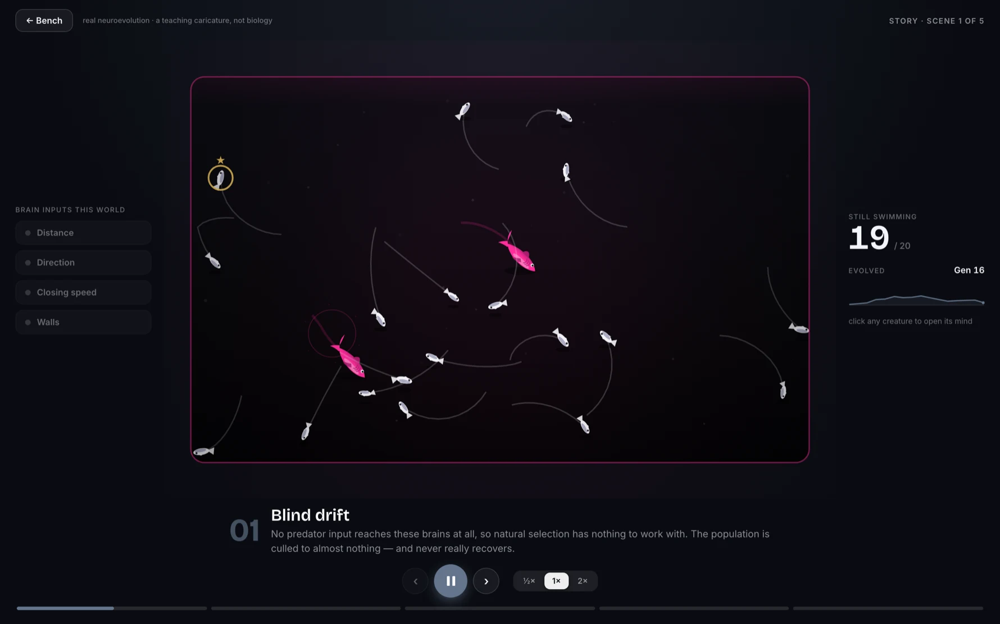

# Darwin Lab

**A browser lab where tiny neural networks evolve real behavior — and nothing about how they
behave is ever programmed.**

**Live: [pouyanjay.github.io/darwinlab](https://pouyanjay.github.io/darwinlab/)**


Each fish carries its own 68-weight neural network. It is never told to flee the shark — most
early fish don't, and get eaten. The ones that happen to swim a little less badly breed, mutate,
and the next generation is born from them. Repeat a few dozen times and the tank is full of
fish that dodge, wall-hug, and scatter — behavior that was _selected for_, not coded. The shark
is fixed rules the whole time: it is a filter, not a teacher.

## The honest finding

The five worlds on the bench are an ablation ladder: each gives evolution one more sense to
work with, from nothing (**Blind drift**) to distance, direction, closing speed, and wall
awareness. The result — measured headlessly over many seeded runs, not eyeballed — is that
**more senses is not more intelligence**:

- **Direction is the only sense that clearly pays**, and only by a few points of survival.
- Distance alone barely beats sensing nothing at all.
- Closing speed and wall sense don't stack on top — this predator never creates dangers those
  inputs uniquely solve, so evolution never learns to use them. An input the world doesn't
  reward is just noise a brain has to overcome.

The lab refuses to fake a clean "more senses → smarter" ladder, because that isn't what
happens. A nightly CI job re-measures the sweep and fails if the finding drifts.

## Schooling — a sense that _does_ pay

The sense ladder shows inputs that don't earn their keep. **The Shoal exhibit shows one that
does** — and the contrast is the whole point: _a sense is worth exactly what the world makes it
worth._

Switch the bench to **The Shoal** and two tanks run the same dangerous ocean and the same brain,
differing only in whether the fish can sense each other. Give the predator a **confusion effect**
— it can hold only one target, and loses its lock (then mills, distracted) when that fish is
buried in a dense crowd — and schooling **evolves on its own**. Nobody writes the flocking; it
appears because it works. Measured as the shoal sense's marginal effect (sense-on vs sense-off at
the same ocean, over many seeded runs), fish that can feel their neighbours pack **~20px tighter
and survive ~4s longer per generation**. Toggle the shoal pill off and the school comes apart.

The honest caveats stay: **cohesion** (tight grouping) is the robust signal; **alignment** is
weaker and lineage-variable, and the readout says so. And it only pays because the shark is fast
enough that fleeing alone can't save you — slow the shark down and grouping stops mattering,
exactly as the thesis predicts.


## What you can do


- **Watch five worlds evolve side by side** — live learning curves, real populations, every
  fish an individual genome.
- **Ablate senses live**: toggling a sense pill feeds 0 into that input slot of every brain in
  the tank — a true ablation on already-evolved minds, mid-swim.
- **Open a mind**: click any fish (★ Champion follows the best lineage) to see its actual
  evolved weights firing, what it senses right now, and its motor outputs — while it swims.
- **Edit the world** without wiping its learning: population, predators, mutation rate, arena.
- **Train, then deploy**: after the training horizon, evolution stops — no more respawns. The
  population the lab bred has to survive on its own, and you watch it decay (half-life
  included). Natural selection with the selection turned off.
- **Switch exhibits**: the sense ladder, or **The Shoal** — where an evolved swarm forms on its
  own and you can break it by switching off the sense that built it.
- **Play the story**: a narrated film of the whole argument, made of live simulations, not
  recordings.




## Two modes: Studio and Research

Everything above is **Studio** — watching one world evolve. Flip the top bar to **Research** and the
same engine becomes an instrument for running MANY simulations and reading a conclusion out of them.
Each experiment runs on a **Web Worker pool**, so a batch of thousands of bouts measures in the
background while the lab stays responsive; nothing here edits the engine — Research only ever _reads_
it.

- **The Sweep** — pick some factors (each sense, predator speed, persistence…) and it runs the full
  factorial across your seeds, then reports each factor's **effect on survival with a 95% interval**.
  A bar that clears zero is a knob that matters; one that straddles zero is a knob that does nothing
  here. It shows intervals only — no significance badge, because a sweep is many comparisons.
- **The Ledger** — state a claim ("direction pays more than distance"), and it designs the two arms,
  measures them, and returns a **supported / refuted verdict** from a single pre-registered contrast —
  the one thing that makes a verdict word honest. Every finding is kept as a dated, reproducible,
  reload-surviving record you can export.
- **The Atlas** — choose two parameters and it paints a **survival landscape** you can pan and zoom:
  coral where fish die fast, teal where they last, with the cliff drawn down the column where survival
  actually falls off (the ~0.88× predator-speed cliff shows up as a near-vertical line). Drill any
  point and **Watch this world** carries that exact config back into Studio.

The two modes are one lab: **Analyse** on any Studio world hands it to Research as the subject every
instrument then explores; the Atlas's **Watch this world** brings a point on the map back to the
bench. The honest finding survives the harder look — Direction is still the only sense whose Sweep bar
clears zero.

## How it works

- **Network**: 8 inputs → 6 hidden (tanh) → 2 outputs (turn, thrust). The genome is the 68
  weights; there is no other memory or logic.
- **Evolution**: fitness = seconds survived. Elitism, champion preservation, tournament
  selection, crossover, mutation. The mutation-rate slider genuinely drives drift.
- **Predator**: fixed rules only — cruise → aim → lunge, predictive interception, and
  persistence (it gets faster and wider-jawed the longer it goes without a kill, so no fish is
  ever permanently safe).
- **Honesty gates**: the engine is a bit-exact port of the original reference implementation
  (a seeded fidelity test drives both off the same random stream and asserts identical state),
  and the survival claims above are pinned by seeded tests plus a nightly re-measurement.

More detail in [ARCHITECTURE.md](ARCHITECTURE.md).

## Development

```bash
npm install
npm run dev            # the lab, at localhost:5173
npm run check          # svelte-check
npm run lint           # prettier + eslint
npm run test:unit      # vitest — engine, stores, components, the fidelity gate
npm run test:e2e       # playwright — builds and previews first
npm run bench:survival # headless science measurement (slow; re-run after ANY engine change)
npm run build          # static build (BASE_PATH=/darwinlab for a GitHub Pages-shaped build)
```

SvelteKit 2 · Svelte 5 runes · TypeScript · client-only static build (no backend). CI runs
check → lint → unit → build on every PR; on `main` the full e2e suite runs against the
Pages-shaped build before deploying it.

## A teaching caricature, not biology

Generations are synchronized, fitness is one number, and a shark is three rules in a trench
coat. The point is not to model the ocean — it is to make the _mechanism_ of selection visible
enough that you can poke it and predict what happens.

## License

[GPL-3.0](LICENSE)
