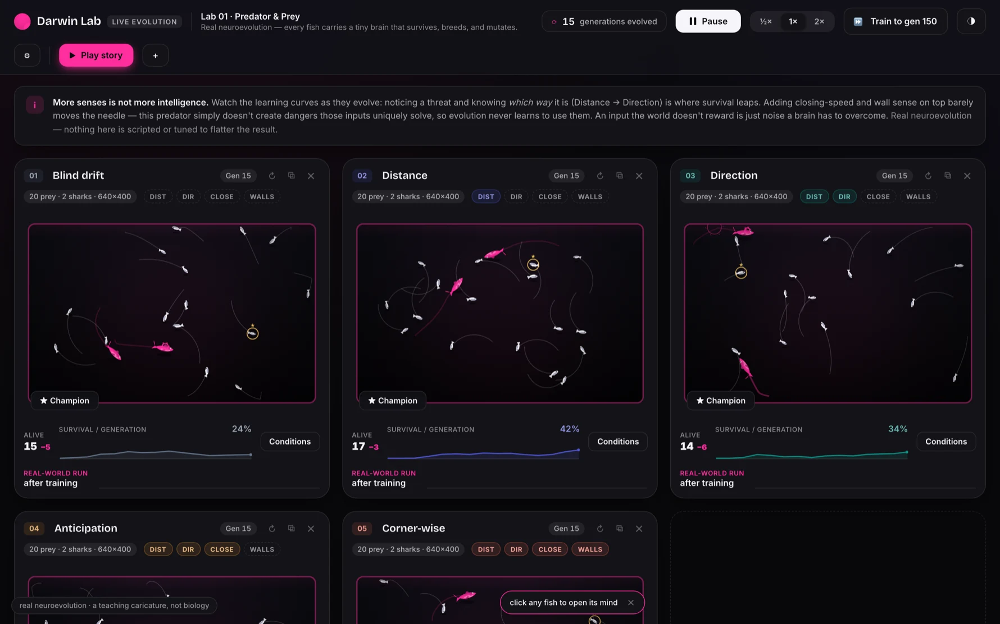
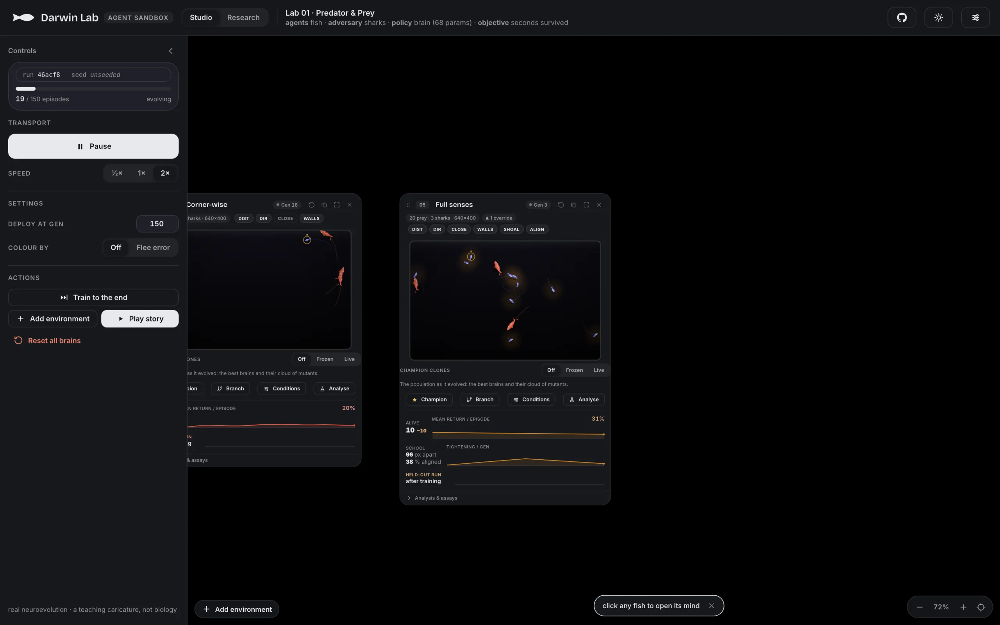
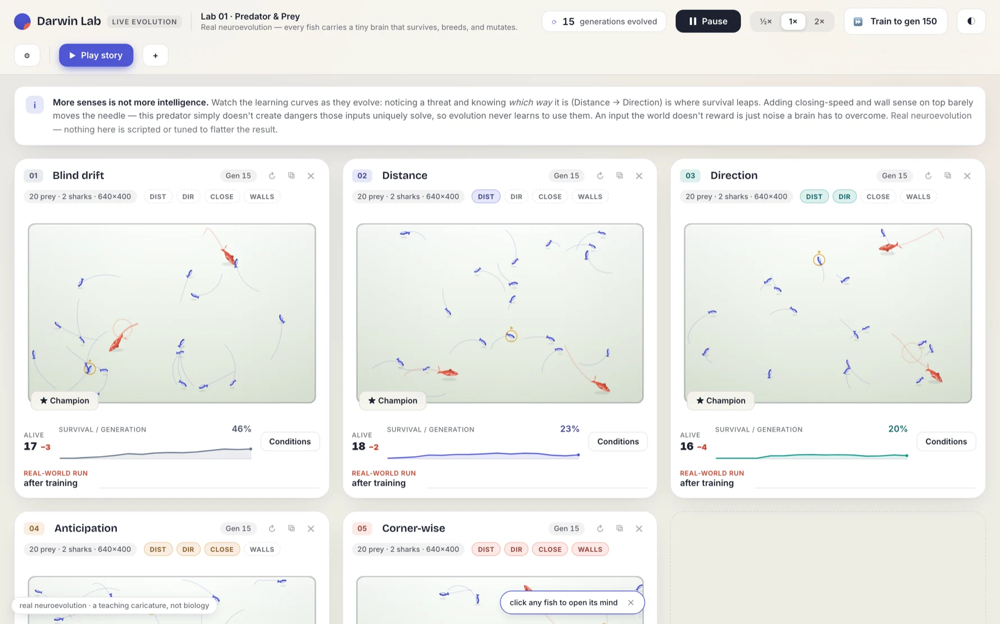
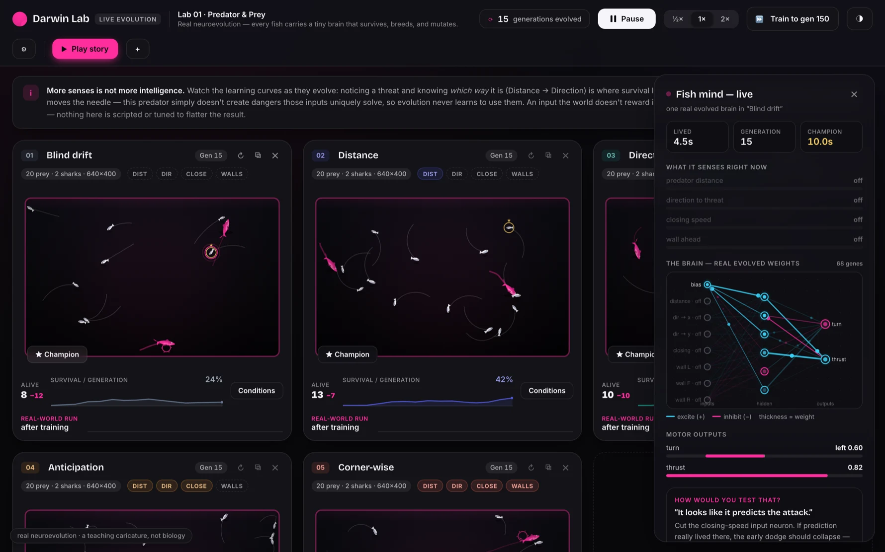
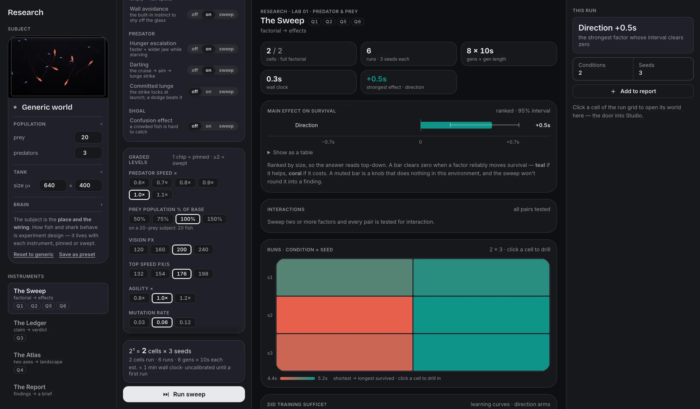
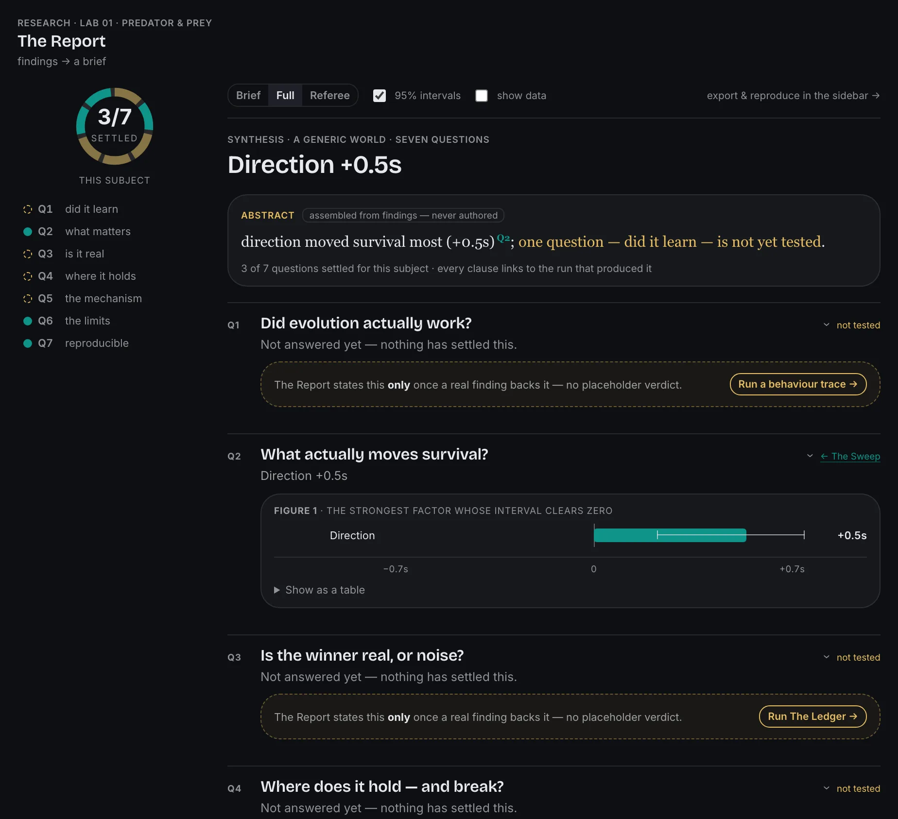

<div align="center">

# Darwin Lab

**A browser lab where tiny neural networks evolve real behavior — and nothing about how they behave is ever programmed.**

[](https://pouyanjay.github.io/darwinlab/)
[](https://github.com/PouyanJay/darwinlab/actions/workflows/ci.yml)
[](LICENSE)
[](https://svelte.dev)
[](https://www.typescriptlang.org)

[**▶ Open the live lab**](https://pouyanjay.github.io/darwinlab/)



</div>

Each fish carries its own 68-weight neural network. It is never told to flee the shark — most early
fish don't, and get eaten. The ones that happen to swim a little less badly breed, mutate, and the
next generation is born from them. Repeat a few dozen times and the tank is full of fish that dodge,
wall-hug, and scatter — behavior that was _selected for_, not coded. The shark is fixed rules the whole
time: it is a **filter, not a teacher.**

Darwin Lab is a client-only, no-backend web app. It has two modes: **Studio**, where you watch one
world evolve, and **Research**, a console for running thousands of simulations and reading a rigorous
conclusion out of them. Both drive one bit-exact neuroevolution engine.

**At a glance:**

- 🧠 **Real neuroevolution, nothing scripted** — every fish is its own 68-weight network; behavior is what survives, not what's coded.
- 🔬 **A research console, not a toy** — factorial sweeps, pre-registered A/B verdicts, survival landscapes, and a report that assembles itself.
- 📊 **An honest finding, defended by CI** — _more senses ≠ more intelligence_; a nightly job re-measures it and fails on drift.
- 🎛️ **Inspect and intervene live** — open any evolved mind, ablate a sense mid-swim, branch a world, then watch it decay once selection stops.
- ⚡ **Client-only static SPA** — SvelteKit 2 · Svelte 5 runes · TypeScript · zero backend; runs entirely in the browser.

## Contents

- [The honest finding](#the-honest-finding)
- [Schooling — a sense that _does_ pay](#schooling--a-sense-that-does-pay)
- [Studio — watch one world evolve](#studio--watch-one-world-evolve)
- [Research — a console for real experiments](#research--a-console-for-real-experiments)
- [Quick start](#quick-start)
- [How it works](#how-it-works)
- [Testing & honesty gates](#testing--honesty-gates)
- [A teaching caricature, not biology](#a-teaching-caricature-not-biology)

## The honest finding

The worlds on the bench are an ablation ladder: each gives evolution one more sense to work with, from
nothing (**Blind drift**) to distance, direction, closing speed, and wall awareness. The result —
measured headlessly over many seeded runs, not eyeballed — is that **more senses is not more
intelligence**:

- **Direction is the only sense that clearly pays**, and only by a few points of survival.
- Distance alone barely beats sensing nothing at all.
- Closing speed and wall sense don't stack on top — this predator never creates dangers those inputs
  uniquely solve, so evolution never learns to use them. An input the world doesn't reward is just
  noise a brain has to overcome.

The lab refuses to fake a clean "more senses → smarter" ladder, because that isn't what happens. A
nightly CI job re-measures the sweep and fails if the finding drifts. This honesty is the product's
spine — it shows up again in every part of the Research console below.

## Schooling — a sense that _does_ pay

The sense ladder shows inputs that don't earn their keep. Schooling is the one that does — and the
contrast is the whole point: _a sense is worth exactly what the world makes it worth._

Turn on **Sense the shoal** in any world's Conditions and two things happen: the brain gains the shoal
senses (the **SHOAL** and **ALIGN** pills), and the predator gains a **confusion effect** — it can hold
only one target, and loses its lock (then mills, distracted) when that fish is buried in a dense crowd.
Nothing writes the flocking. It **evolves on its own**, because now it works: measured as the shoal
sense's marginal effect over many seeded runs, fish that can feel their neighbours pack **~20px tighter
and survive ~4s longer per generation**. The tank paints a live **density field** — a bait-ball glows,
a loose crowd doesn't — and the tile reads out the school's spacing and alignment as they tighten.
Toggle the shoal senses back off and the school comes apart.

The honest caveats stay: **cohesion** (tight grouping) is the robust signal; **alignment** is weaker
and lineage-variable, and the readout says so. And it only pays because the shark is fast enough that
fleeing alone can't save you — slow the shark down and grouping stops mattering, exactly as the thesis
predicts.



## Studio — watch one world evolve



- **Watch worlds evolve side by side** — live learning curves, real populations, every fish an
  individual genome, laid out on a pannable/zoomable lineage tree.
- **Ablate senses live**: toggling a sense pill feeds 0 into that input slot of every brain in the
  tank — a true ablation on already-evolved minds, mid-swim.
- **Open a mind**: click any fish (★ Champion follows the best lineage) to see its actual evolved
  weights firing, what it senses right now, and its motor outputs — while it swims.
- **Branch a world**: fork it into a wired child that inherits the parent's evolved genomes, then
  change one condition — a controlled experiment with a common ancestor.
- **Train, then deploy**: after the training horizon, evolution stops — no more respawns. The
  population the lab bred has to survive on its own, and you watch it decay (half-life included).
  Natural selection with the selection turned off.
- **Play the story**: a narrated film of the whole argument, made of live simulations, not recordings.



## Research — a console for real experiments

Flip the top bar to **Research** and the same engine becomes a **console** for running many simulations
and reading a conclusion out of them: a left **rail** (the subject world, the instruments, the findings
notebook), a **design panel** for the active instrument, a **workspace** of results, and a **drill
sidebar** of context. Batches run on a **Web Worker pool**, so thousands of bouts measure in the
background while the lab stays responsive. Nothing here edits the engine — Research only ever _reads_ it.



The console is organised around the **seven questions a rigorous study must answer**, and each
instrument is tagged with the ones it settles:

- **The Sweep** _(Q2 · Q6)_ — pick some factors (each sense, predator speed, persistence…) and it runs
  the full factorial across your seeds, then reports each factor's **effect on survival with a 95%
  interval**, the **interactions** between pairs, and a **convergence check** that flags an
  under-trained run instead of reporting it as truth. A bar that clears zero is a knob that matters; one
  that straddles zero is a kept negative, not a gap to hide.
- **The Ledger** _(Q3)_ — state a claim ("direction pays more than distance"), and it designs the two
  arms, measures them, and returns a **supported / refuted verdict** from a single pre-registered
  contrast — the one thing that makes a verdict word honest.
- **The Atlas** _(Q4)_ — choose two parameters and it paints a **survival landscape** you can pan and
  zoom: coral where fish die fast, teal where they last, with the cliff drawn where survival actually
  falls off. Drill any point and **Watch this world** carries that config into Studio.
- **The microscope** _(Q1 · Q5)_ — not a separate instrument but a lens inside the Sweep's drill: pick
  any run, and **Trace this world** re-evolves that exact recipe _keeping its genomes_, reads the
  **learning curve** (did it climb and converge?), then traces the evolved school against a
  **random-brain control** on the same bout. The mechanism — accurate fleeing, distance kept — reads as
  the gap between the two, in bars and in the paths each school actually swam.

### The Report — a paper that assembles itself

The findings you keep flow into **The Report**, which assembles them into a **seven-question brief** —
and refuses to say a word more than was measured.



- A **coverage spine** shows at a glance how much of a rigorous study is settled — a filled arc per
  answered question, a hollow one per honest gap.
- An **auto-composed abstract** writes a few sentences from the real findings, each cited back to the
  question it came from — templated from measured numbers, never authored.
- Each question is a **numbered figure** drawn from its evidence, collapsible, with a **drill-through**
  link back to the instrument that produced it.
- **Reading modes** (Brief / Full / Referee) and **skeptic toggles** (95% intervals, raw data tables)
  let a reader interrogate every claim; a **tensions** check flags findings that pull against each
  other rather than averaging them away.
- Export it as **Markdown**, print it to **PDF**, or **reproduce** its exact world back in Studio.

**The honesty rail is the whole point:** a question reads _answered_ **only** when a real finding backs
it; every other question stays an honest "run the test" prompt. The Report can never claim more than
the notebook holds.

The two modes are one lab: **Analyse** on any Studio world hands it to Research as the subject every
instrument then explores; **Watch this world** brings a finding or a map point back to the bench. The
honest finding survives the harder look — Direction is still the only sense whose Sweep bar clears zero.

## Quick start

A `Makefile` is the one entry point — you never need to memorise script names.

```bash
make run     # everything, end to end: install deps, then start the dev server
```

`make run` verifies your Node version, installs dependencies (skipped when nothing changed), downloads
the test browsers, and starts the dev server on the first free port — printing the URL when it's ready.
Run `make` on its own for the full command reference.

| Command         | What it does                                                  |
| --------------- | ------------------------------------------------------------- |
| `make run`      | Install + start the dev server (the one command for day one)  |
| `make start`    | Start the dev server (auto-allocates a free port)             |
| `make preview`  | Build, then serve the production build                        |
| `make stop`     | Tear down anything `make` started                             |
| `make test`     | Unit + e2e, aggregated (never stops at the first failure)     |
| `make lint`     | Prettier + ESLint + `svelte-check`                            |
| `make lint-fix` | Auto-fix what can be fixed, then re-check                     |
| `make deploy`   | Publish to GitHub Pages **on demand** — merging never deploys |

Prefer running the tools directly? The underlying npm scripts still work:

```bash
npm install
npm run dev            # the lab, at localhost:5173
npm run check          # svelte-check
npm run lint           # prettier + eslint
npm run test:unit      # vitest — engine, stores, components, the fidelity gate
npm run test:e2e       # playwright — builds and previews first
npm run bench:survival # headless science measurement (slow; re-run after ANY engine change)
npm run build          # static build (BASE_PATH=/darwinlab for a GitHub Pages-shaped build)
```

**CI & deploy.** Every pull request runs `check → lint → unit → build`; every push to `main`
additionally runs the full Playwright e2e suite against a Pages-shaped build. **Merging to `main` never
publishes** — it only proves `main` is shippable. Deploying is a deliberate, on-demand step (`make
deploy`), so `main` and the live site diverge until you choose to publish.

## How it works

- **Network**: 8 inputs → 6 hidden (tanh) → 2 outputs (turn, thrust). The genome is the 68 weights;
  there is no other memory or logic. Worlds that add senses widen the input layer accordingly.
- **Evolution**: fitness = seconds survived. Elitism, champion preservation, tournament selection,
  crossover, mutation. The mutation-rate slider genuinely drives drift.
- **Predator**: fixed rules only — cruise → aim → lunge, predictive interception, and persistence (it
  gets faster and wider-jawed the longer it goes without a kill, so no fish is ever permanently safe).
- **The science is walled off from the UI**: the engine is pure, framework-agnostic TypeScript with
  zero Svelte/DOM imports, so it runs identically in the app, in unit tests, and in the headless bench.

More detail — the layout, the state architecture, and the honesty rails — in
[ARCHITECTURE.md](ARCHITECTURE.md).

## Testing & honesty gates

The engine is a **bit-exact port** of the original reference implementation, and it stays that way by
proof, not promise:

1. **Port fidelity** — a seeded test drives our engine and the vendored reference off the _same_ random
   stream and asserts bit-identical state. If it fails, the port diverged; it is never loosened.
2. **The science** — seeded sweeps pin the honest finding (Direction is the only sense that clearly
   pays, extras don't stack), and a nightly CI job re-measures and fails if any world drifts.
3. **Schooling** — a 2×2 ablation confirms flocking both _evolves_ and _pays_ under predator attention,
   and does not under the mechanics that came before it.

The full suite is Vitest (unit + real-Chromium component specs, including the fidelity gate) and
Playwright (e2e, zero axe violations in both themes). This codebase actively hunts "theater tests" —
every guard is proven by breaking the thing it protects and watching it fail.

## A teaching caricature, not biology

Generations are synchronized, fitness is one number, and a shark is three rules in a trench coat. The
point is not to model the ocean — it is to make the _mechanism_ of selection visible enough that you
can poke it and predict what happens.

## License

[GPL-3.0](LICENSE)
